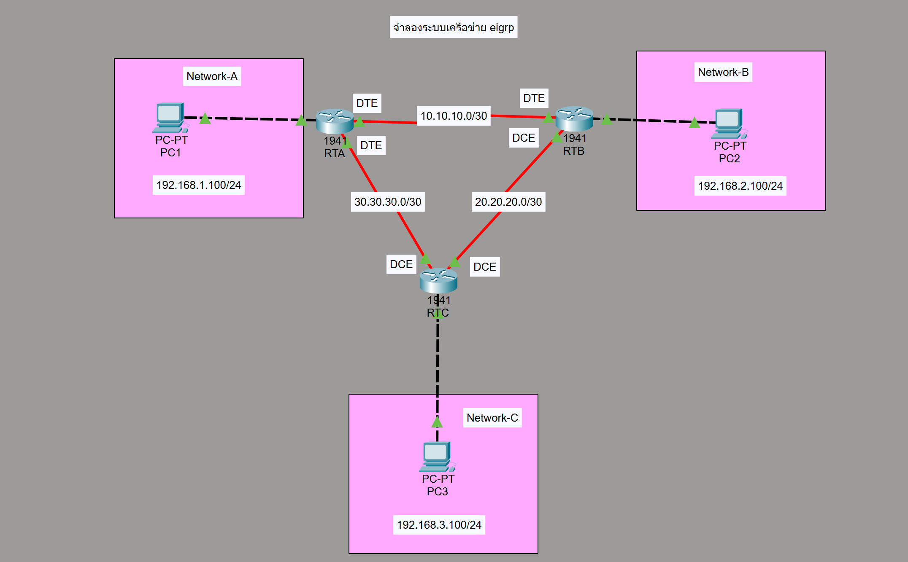

# EIGRP Routing Lab

This lab demonstrates configuring Enhanced Interior Gateway Routing Protocol (EIGRP) on three Cisco routers to enable dynamic routing between multiple networks.

---

## Network Topology

---

## Devices Used

- 3 × Cisco Router 1941
- 3 × PC
- V.35 DCE-to-DTE Serial Cables
- UTP Cross-over Cables

---

## Network Design

|    Link   |    Network     |
|-----------|----------------|
| Network A | 192.168.1.0/24 |
| Network B | 192.168.2.0/24 |
| Network C | 192.168.3.0/24 |
| RTA – RTB | 10.10.10.0/30  |
| RTB – RTC | 20.20.20.0/30  |
| RTA – RTC | 30.30.30.0/30  |

---

## PC Configuration

### PC1
IP Address: 192.168.1.100  
Subnet Mask: 255.255.255.0  
Default Gateway: 192.168.1.1  

### PC2
IP Address: 192.168.2.100  
Subnet Mask: 255.255.255.0  
Default Gateway: 192.168.2.1  

### PC3
IP Address: 192.168.3.100  
Subnet Mask: 255.255.255.0  
Default Gateway: 192.168.3.1  

---

## Router Configuration

### RTA

router eigrp 100
no auto-summary
network 192.168.1.0 0.0.0.255
network 10.10.10.0 0.0.0.3
network 30.30.30.0 0.0.0.3

### RTB

router eigrp 100
no auto-summary
network 192.168.2.0 0.0.0.255
network 10.10.10.0 0.0.0.3
network 20.20.20.0 0.0.0.3

### RTC

router eigrp 100
no auto-summary
network 192.168.3.0 0.0.0.255
network 20.20.20.0 0.0.0.3
network 30.30.30.0 0.0.0.3

---

## Verification Commands

show ip route
show ip eigrp neighbors
show ip interface brief

---

## Testing Connectivity

Ping between all PCs to verify connectivity.

Example:

ping 192.168.1.100
ping 192.168.2.100
ping 192.168.3.100

Expected Result:  
All PCs should be able to communicate with each other.