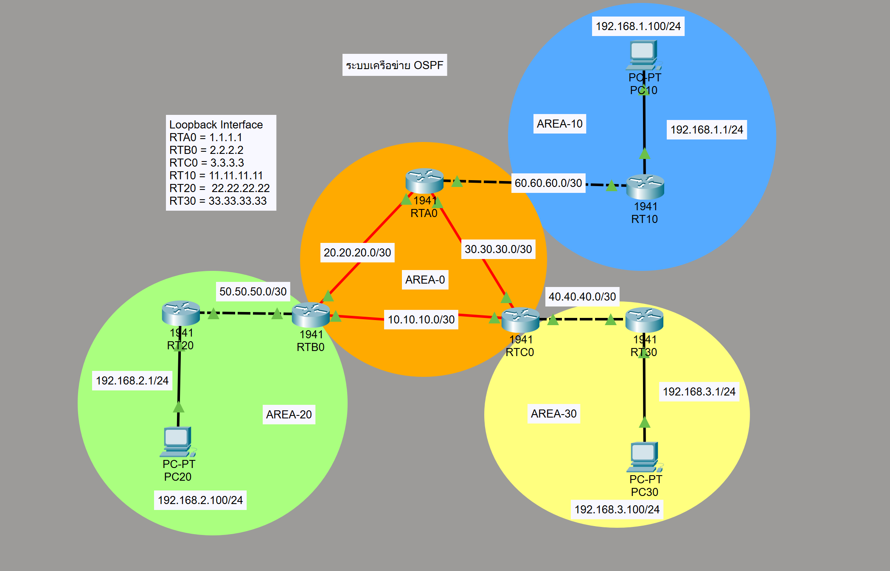

# OSPF Lab (Cisco Packet Tracer)

## Overview
This lab demonstrates how to configure multi-area OSPF routing in Cisco Packet Tracer.  
The network is divided into Area 0, Area 10, Area 20, and Area 30.  
OSPF is used to exchange routes between multiple routers and enable end-to-end communication between all PCs.

---

## Network Topology


---

## Devices Used

6 × Cisco Router 1941
3 × PC
V.35 DCE-to-DTE serial cables
UTP cross-over cables

---

## OSPF Area Design

Area 0: Backbone area
Area 10: PC10 network
Area 20: PC20 network
Area 30: PC30 network

---

## IP Addressing

### PC Configuration

PC10  
IP Address: 192.168.1.100  
Subnet Mask: 255.255.255.0  
Default Gateway: 192.168.1.1  

PC20  
IP Address: 192.168.2.100  
Subnet Mask: 255.255.255.0  
Default Gateway: 192.168.2.1  

PC30  
IP Address: 192.168.3.100  
Subnet Mask: 255.255.255.0  
Default Gateway: 192.168.3.1  

---

## Loopback Interfaces
RTA0 = 1.1.1.1
RTB0 = 2.2.2.2
RTC0 = 3.3.3.3
RT10 = 11.11.11.11
RT20 = 22.22.22.22
RT30 = 33.33.33.33

---

## Router Interface Configuration

### RTA0
20.20.20.1/30
30.30.30.2/30
60.60.60.1/30
Loopback0: 1.1.1.1/32

### RTB0
10.10.10.1/30
20.20.20.2/30
50.50.50.1/30
Loopback0: 2.2.2.2/32

### RTC0
30.30.30.1/30
10.10.10.2/30
40.40.40.1/30
Loopback0: 3.3.3.3/32

### RT10
60.60.60.2/30
192.168.1.1/24
Loopback0: 11.11.11.11/32

### RT20
50.50.50.2/30
192.168.2.1/24
Loopback0: 22.22.22.22/32

### RT30
40.40.40.2/30
192.168.3.1/24
Loopback0: 33.33.33.33/32

---

## Router Configuration

### RTA0
cisco
enable
configure terminal
hostname RTA0

interface s0/0/0
 ip address 20.20.20.1 255.255.255.252
 clock rate 128000
 no shutdown

interface s0/0/1
 ip address 30.30.30.2 255.255.255.252
 no shutdown

interface g0/0
 ip address 60.60.60.1 255.255.255.252
 no shutdown

interface loopback0
 ip address 1.1.1.1 255.255.255.255

router ospf 1
 network 1.1.1.1 0.0.0.0 area 0
 network 20.20.20.1 0.0.0.0 area 0
 network 30.30.30.2 0.0.0.0 area 0
 network 60.60.60.1 0.0.0.0 area 10

### RTB0
cisco
enable
configure terminal
hostname RTB0

interface s0/0/0
 ip address 10.10.10.1 255.255.255.252
 clock rate 128000
 no shutdown

interface s0/0/1
 ip address 20.20.20.2 255.255.255.252
 no shutdown

interface g0/0
 ip address 50.50.50.1 255.255.255.252
 no shutdown

interface loopback0
 ip address 2.2.2.2 255.255.255.255

router ospf 1
 network 2.2.2.2 0.0.0.0 area 0
 network 20.20.20.2 0.0.0.0 area 0
 network 10.10.10.1 0.0.0.0 area 0
 network 50.50.50.1 0.0.0.0 area 20

### RTC0
cisco
enable
configure terminal
hostname RTC0

interface s0/0/0
 ip address 30.30.30.1 255.255.255.252
 clock rate 128000
 no shutdown

interface s0/0/1
 ip address 10.10.10.2 255.255.255.252
 no shutdown

interface g0/0
 ip address 40.40.40.1 255.255.255.252
 no shutdown

interface loopback0
 ip address 3.3.3.3 255.255.255.255

router ospf 1
 network 3.3.3.3 0.0.0.0 area 0
 network 10.10.10.2 0.0.0.0 area 0
 network 30.30.30.1 0.0.0.0 area 0
 network 40.40.40.1 0.0.0.0 area 30

### RT10
cisco
enable
configure terminal
hostname RT10

interface g0/0
 ip address 60.60.60.2 255.255.255.252
 no shutdown

interface g0/1
 ip address 192.168.1.1 255.255.255.0
 no shutdown

interface loopback0
 ip address 11.11.11.11 255.255.255.255

router ospf 1
 network 11.11.11.11 0.0.0.0 area 10
 network 60.60.60.0 0.0.0.3 area 10
 network 192.168.1.0 0.0.0.255 area 10

### RT20
cisco
enable
configure terminal
hostname RT20

interface g0/0
 ip address 50.50.50.2 255.255.255.252
 no shutdown

interface g0/1
 ip address 192.168.2.1 255.255.255.0
 no shutdown

interface loopback0
 ip address 22.22.22.22 255.255.255.255

router ospf 1
 network 22.22.22.22 0.0.0.0 area 20
 network 50.50.50.0 0.0.0.3 area 20
 network 192.168.2.0 0.0.0.255 area 20

### RT30
cisco
enable
configure terminal
hostname RT30

interface g0/0
 ip address 40.40.40.2 255.255.255.252
 no shutdown

interface g0/1
 ip address 192.168.3.1 255.255.255.0
 no shutdown

interface loopback0
 ip address 33.33.33.33 255.255.255.255

router ospf 1
 network 33.33.33.33 0.0.0.0 area 30
 network 40.40.40.0 0.0.0.3 area 30
 network 192.168.3.0 0.0.0.255 area 30

---

## Verification Commands

Check routing table
cisco
show ip route

Check OSPF routes only
cisco
show ip route ospf

Check OSPF protocol information
cisco
show ip protocols

Check neighbor relationships
cisco
show ip ospf neighbor

Check interface and area information
cisco
show ip ospf interface

Connectivity test
cisco
ping 192.168.2.100
ping 192.168.3.100
tracert 192.168.2.100
tracert 192.168.3.100

---

## Expected Result
All routers form correct OSPF neighbor relationships
OSPF routes appear in the routing table
PCs in different areas can communicate successfully
End-to-end connectivity is verified by ping and traceroute
Multi-area OSPF works correctly through Area 0 as the backbone

---

## Files Included
```
ospf
 ├── README.md
 ├── topology.png
 └── ospf.pkt
 ```

---

## Learning Outcome
Configure multi-area OSPF
Use wildcard masks in OSPF network statements
Configure loopback interfaces
Verify OSPF neighbors and routes
Understand backbone and non-backbone area design