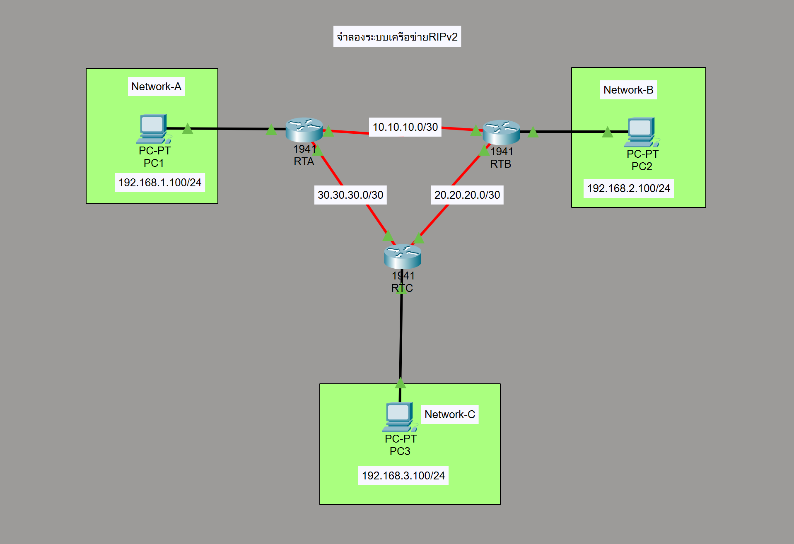

# RIP v2 Lab (Cisco Packet Tracer)

## Overview
This lab demonstrates how to configure dynamic routing using RIP version 2 in Cisco Packet Tracer.  
Three routers are connected in a triangular topology, and each router connects to one local LAN.  
RIPv2 is used to advertise all connected networks and enable end-to-end communication between all PCs.

---

## Network Topology


---

## Devices Used
3 × Cisco Router 1941
3 × PC
3 × V.35 DCE-to-DTE serial cables
UTP cross-over cables

---

## IP Addressing

### PC Configuration

PC1  
IP Address: 192.168.1.100  
Subnet Mask: 255.255.255.0  
Default Gateway: 192.168.1.1  

PC2  
IP Address: 192.168.2.100  
Subnet Mask: 255.255.255.0  
Default Gateway: 192.168.2.1  

PC3  
IP Address: 192.168.3.100  
Subnet Mask: 255.255.255.0  
Default Gateway: 192.168.3.1  

---

## Router Interface Configuration

### Router A
G0/0 → 192.168.1.1 /24  
S0/0/0 → 10.10.10.1 /30  
S0/1/0 → 30.30.30.2 /30  

### Router B
G0/0 → 192.168.2.1 /24  
S0/0/0 → 20.20.20.1 /30  
S0/1/0 → 10.10.10.2 /30  

### Router C
G0/0 → 192.168.3.1 /24  
S0/0/0 → 30.30.30.1 /30  
S0/1/0 → 20.20.20.2 /30  

---

## Router Configuration

### Router A
cisco
config t
int g0/0
ip addr 192.168.1.1 255.255.255.0
no shutdown

int s0/0/0
ip addr 10.10.10.1 255.255.255.252
clock rate 56000
no shutdown

int s0/1/0
ip addr 30.30.30.2 255.255.255.252
no shutdown

router rip
version 2
no auto-summary
network 10.0.0.0
network 30.0.0.0
network 192.168.1.0

### Router B
cisco
config t
int g0/0
ip addr 192.168.2.1 255.255.255.0
no shutdown

int s0/0/0
ip addr 20.20.20.1 255.255.255.252
clock rate 56000
no shutdown

int s0/1/0
ip addr 10.10.10.2 255.255.255.252
no shutdown

router rip
version 2
no auto-summary
network 10.0.0.0
network 20.0.0.0
network 192.168.2.0

### Router C
cisco
config t
int g0/0
ip addr 192.168.3.1 255.255.255.0
no shutdown

int s0/0/0
ip addr 30.30.30.1 255.255.255.252
clock rate 56000
no shutdown

int s0/1/0
ip addr 20.20.20.2 255.255.255.252
no shutdown

router rip
version 2
no auto-summary
network 20.0.0.0
network 30.0.0.0
network 192.168.3.0

---

## Verification Commands

Check interface status
cisco
show ip interface brief

Check routing table
cisco
show ip route

Check RIP parameters
cisco
show ip protocols

Test connectivity
cisco
ping 192.168.2.100
ping 192.168.3.100
tracert 192.168.2.100
tracert 192.168.3.100

---

## Expected Result
All routers learn remote networks through RIPv2
PCs in different networks can communicate successfully
RIP routes appear in the routing table
End-to-end connectivity is verified by ping and traceroute

---

## Files Included
```text
rip/
 ├── README.md
 ├── topology.png
 └── rip.pkt
```

---

## Learning Outcome
Configure RIPv2 routing
Advertise classful networks with RIPv2
Disable auto-summary
Verify routing tables and protocol status
Test convergence and connectivity between multiple networks