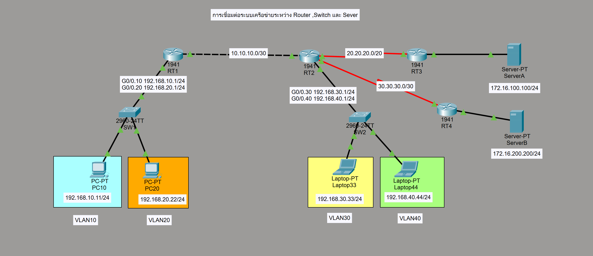

# Static Routing Lab (Cisco Packet Tracer)

## Overview
This lab demonstrates how to configure Static Routing between two networks using Cisco routers.  
Static routes are manually configured to enable communication between different subnets.

---

## Network Topology


---

## Devices Used
- 2 × Cisco Router 1841
- 2 × Switch
- 2 × PC
- Serial DCE/DTE Cable
- Copper Straight-through Cable

---

## IP Addressing

### PC Configuration

PC0  
IP Address: 192.168.1.2  
Subnet Mask: 255.255.255.0  
Default Gateway: 192.168.1.1  

PC1  
IP Address: 192.168.2.2  
Subnet Mask: 255.255.255.0  
Default Gateway: 192.168.2.1  

---

## Router Interface Configuration

R1  
G0/0 → 192.168.1.1 /24  
S0/0/0 → 10.0.0.1 /30  

R2  
G0/0 → 192.168.2.1 /24  
S0/0/0 → 10.0.0.2 /30  

---

## Router Configuration

### R1
```
enable
configure terminal

interface g0/0
ip address 192.168.1.1 255.255.255.0
no shutdown

interface s0/0/0
ip address 10.0.0.1 255.255.255.252
clock rate 64000
no shutdown

ip route 192.168.2.0 255.255.255.0 10.0.0.2

end
write memory
```

### R2
```
enable
configure terminal

interface g0/0
ip address 192.168.2.1 255.255.255.0
no shutdown

interface s0/0/0
ip address 10.0.0.2 255.255.255.252
no shutdown

ip route 192.168.1.0 255.255.255.0 10.0.0.1

end
write memory
```

---

## Verification Commands

Check Interface
```
show ip interface brief
```

Check Routing Table
```
show ip route
```

Ping Test
```
ping 192.168.2.2
```

---

## Expected Result
- PCs can communicate across networks
- Static route appears in routing table
- All interfaces are up/up

---

## Files Included
```
static-routing-v2/
 ├── README.md
 ├── topology.png
 └── static-v2.pkt
```

---

## Learning Outcome
- Configure static routing
- Configure router interfaces
- Verify connectivity
- Understand routing table